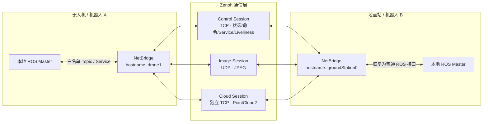

<div align="center">

# NetBridgeForSwarm

### 面向 ROS1 Noetic 多机与集群系统的轻量、稳定、低带宽通信桥

让每台机器人保留独立 ROS Master，通过 Zenoh 完成跨主机 Topic、Service 与节点状态互通，
重点解决 **ROS1 组网复杂、无线多机通信不稳定、图像/点云挤占控制链路** 的问题。

[](#环境与兼容性)
[](#环境与兼容性)
[](#安装)
[](swarm_ros_bridge/CMakeLists.txt)
[](#环境与兼容性)
[](LICENSE.txt)

[English](README.md)

[快速开始](#快速开始) · [配置手册](#配置手册) · [部署指南](#部署指南) · [运行与监控](#运行与监控) · [故障排查](#故障排查)

</div>

---

## 项目介绍

NetBridgeForSwarm 是一个运行在 ROS1 Noetic 节点旁的通信桥。每台无人机、机器人或地面站只连接自己的本地 ROS Master；Bridge 按 YAML 中的白名单订阅本地 Topic，通过 Zenoh 发送到指定主机，再在目标 ROS Master 下恢复为普通 ROS Topic。ROS Service 以同样方式通过 Zenoh query/reply 跨机代理。

它不是把整个 ROS 计算图无差别暴露到网络，而是只传输配置中明确声明的数据，并针对命令、状态、图像和点云分别采用合适的链路、优先级、队列和压缩策略。

### 核心解决的问题

| ROS1 多机场景中的问题 | NetBridgeForSwarm 的处理方式 | 带来的效果 |
|---|---|---|
| 每台机器需要维护 `ROS_MASTER_URI`、`ROS_IP`、主机名解析和可达端口 | 每机保留本地 ROS Master，跨机部分只配置逻辑主机名与路由 | 降低部署和扩容复杂度，单机 ROS 图不依赖远端 Master |
| Wi-Fi、Mesh 或机载网络抖动时，连接恢复和节点状态难以观察 | Zenoh 自动发现/静态连接、liveliness 节点存活和重连诊断 | 提高弱网环境的可维护性，快速定位离线与链路异常 |
| 图像、点云等大数据容易阻塞控制、状态和 Service | 控制 TCP、图像 UDP、点云独立 TCP 三 Session 隔离 | 减少大流量数据对关键控制链路的队头阻塞 |
| 原始图像和点云占用带宽高，多机扩展后网络负担迅速增长 | 限频、JPEG 缩放与自适应质量、VoxelGrid、Draco/PCL 压缩、定向路由 | 只发送需要的数据，并主动控制大消息带宽 |
| 旧数据在接收端积压，恢复后仍在处理过期状态或画面 | `state`/`bulk` 有界队列丢旧保新，`command`/Service 使用可靠阻塞策略 | 优先保证实时性，同时保护关键指令和请求 |

### 主要功能

- 跨独立 ROS Master 转发 ROS Topic 与 Service。
- 通过 `srcIP`/`dstIP` 白名单进行一对一、一对多、多对一和全机路由。
- 三条相互隔离的 Zenoh Session：控制/状态/Service 走 TCP，图像走 UDP，点云走独立 TCP。
- `command`、`state`、`bulk` 三类 Topic QoS，分别匹配可靠性、优先级和拥塞策略。
- Topic 仅配置名称，Bridge 从 ROS1 连接头自动发现类型、MD5、完整定义和 latching 状态。
- `sensor_msgs/Image` 自动转为 JPEG，可缩放并按目标带宽自适应调节质量。
- `sensor_msgs/PointCloud2` 支持 VoxelGrid 降采样以及 Draco、PCL Octree 压缩。
- 保留并校验 ROS type、MD5、来源主机、序号、时间戳和 `frame_id`。
- 支持带 `to_drone_ids` 字段的自定义消息按无人机 ID 动态定向发送。
- 提供 `/swarm_bridge/diagnostics` 诊断 Topic 和自适应终端 TUI。
- 支持 `amd64`、`arm64`，提供 Ubuntu 20.04 原生 Zenoh 1.9.0 Debian 包和最小运行时 Docker 镜像。

## 工作原理



| Session | 默认承载内容 | 链路限制 | 设计目的 |
|---|---|---|---|
| Control | 普通 Topic、命令、连续状态、Service、节点存活 | TCP | 保护关键数据和请求/响应 |
| Image | `sensor_msgs/Image`，Bridge 内编码为 JPEG | UDP | 避免图像重传和拥塞影响控制链路 |
| Cloud | `sensor_msgs/PointCloud2`，可压缩 | 独立 TCP | 可靠传输大点云，同时与控制 TCP 隔离 |

Zenoh 收包回调只把已校验的 envelope 放入有界队列，ROS 反序列化和发布由独立、可停止的 worker 完成。传输协议使用版本化 `NBZ2` envelope；完整 Schema 只在 Control Session 协商，数据包只携带轻量 type/MD5/codec 元数据。

## 环境与兼容性

| 项目 | 支持范围 |
|---|---|
| 操作系统 | Ubuntu 20.04 Focal |
| ROS | ROS1 Noetic + catkin |
| CPU 架构 | `amd64`、`arm64` |
| 编译标准 | C++17，CMake 3.16+ |
| Zenoh | `zenoh-c` / `zenoh-cpp` **固定为 1.9.0** |
| 网络 | 同一二层网络自动发现，或可互访的静态 TCP/UDP endpoint |

> [!IMPORTANT]
> 仓库中的 Zenoh `.deb` 是在 Ubuntu 20.04 原生构建的。不要把其他 Ubuntu 版本生成的包直接复制到 Focal，也不要混用其他 Zenoh 版本，否则 CMake 或运行时 ABI 可能不兼容。

普通 ROS1 Topic 不再需要编译期注册。Bridge 通过 `topic_tools::ShapeShifter` 取得并转发原始 ROS 序列化字节，接收端根据远端 Schema 动态 advertise；因此接收 Bridge 本身不要求安装对应消息包。

以下类型有内置 wire codec 特化：

- `nav_msgs/Odometry`
- `sensor_msgs/Image`
- `sensor_msgs/PointCloud2`

当前内置的 Service 类型：

- `std_srvs/Empty`
- `swarm_ros_bridge/AddTwoInts`

只有 Bridge 需要读取消息字段（目前为 `to_drone_ids`）时才需注册 Topic 类型。Service 仍需编译期注册，方法见[添加自定义消息与 Service](#添加自定义消息与-service)。

## 快速开始

以下流程以“`drone1` 向 `groundStation0` 发送 `/chatter`”为例。两台机器各自运行本地 ROS Master，安装相同版本的 Bridge，并使用相同的主机清单与路由规则。

### 1. 安装系统依赖

先按 [ROS Noetic 官方说明](http://wiki.ros.org/noetic/Installation/Ubuntu)安装 ROS，然后在每台机器执行：

```bash
sudo apt-get update
sudo apt-get install -y \
  build-essential \
  cmake \
  git \
  libopencv-dev \
  libpcl-dev \
  ros-noetic-message-generation \
  ros-noetic-pcl-conversions \
  ros-noetic-topic-tools \
  ros-noetic-visualization-msgs
```

### 2. 创建 catkin 工作空间并克隆仓库

```bash
source /opt/ros/noetic/setup.bash
mkdir -p ~/netbridge_ws/src
cd ~/netbridge_ws/src
git clone https://github.com/Gaiwqqq/NetBridgeForSwarm.git
cd NetBridgeForSwarm
```

FTXUI、Draco 和适配版 `cv_bridge` 已包含在仓库中，不需要额外克隆子模块。

### 3. 安装 Zenoh 1.9.0

先校验仓库内二进制包，再安装当前 CPU 架构对应的包：

```bash
cd ~/netbridge_ws/src/NetBridgeForSwarm/zenoh-debs
sha256sum -c SHA256SUMS

cd ..
sudo dpkg -i "./zenoh-debs/$(dpkg --print-architecture)"/*.deb
```

确认版本：

```bash
dpkg-query -W libzenohc libzenohc-dev libzenohcpp-dev
```

输出的三个版本都应为 `1.9.0`。若当前架构不是 `amd64` 或 `arm64`，需按[重新构建 Zenoh Debian 包](#重新构建-zenoh-debian-包)操作。

### 4. 编译

```bash
cd ~/netbridge_ws
source /opt/ros/noetic/setup.bash
catkin_make \
  -DCMAKE_BUILD_TYPE=Release \
  -DCV_BRIDGE_BUILD_PYTHON=OFF \
  -DPYTHON_EXECUTABLE=/usr/bin/python3
source devel/setup.bash
```

验证 ROS 能找到软件包：

```bash
rospack find swarm_ros_bridge
```

每次打开新终端都需要加载 ROS 和工作空间环境：

```bash
source /opt/ros/noetic/setup.bash
source ~/netbridge_ws/devel/setup.bash
```

### 5. 配置主机清单

编辑 [`swarm_ros_bridge/config/ip_real.yaml`](swarm_ros_bridge/config/ip_real.yaml)，保证每台机器的本地主机名都在列表中：

```yaml
hosts:
  - groundStation0
  - drone1
```

这里是 Bridge 的**逻辑主机名**，不是 Linux hostname，也不是 IP 地址。以 `drone` 开头的名称必须使用数字后缀，例如 `drone1`。

### 6. 添加最小 Topic 路由

在 [`swarm_ros_bridge/config/default.yaml`](swarm_ros_bridge/config/default.yaml) 的 `topics` 列表中加入：

```yaml
- topic_name: /chatter
  qos_class: state
  srcIP: [drone1]
  dstIP: [groundStation0]
  max_freq: 10
  prefix: true
  same_prefix: false
```

`srcIP` 和 `dstIP` 是为兼容旧配置而保留的字段名，其中填写的是上一步定义的逻辑主机名。

### 7. 启动并验证

在 `drone1` 上：

```bash
export DRONE_ID=1
roslaunch swarm_ros_bridge example_bridge_drone.launch
```

另开一个 `drone1` 终端发布测试消息：

```bash
rostopic pub -r 2 /chatter std_msgs/String "data: 'hello from drone1'"
```

在 `groundStation0` 上：

```bash
roslaunch swarm_ros_bridge example_bridge_station.launch
```

另开一个地面站终端接收：

```bash
rostopic echo /drone1/chatter
```

能持续看到消息即表示本地 ROS、Bridge 路由和 Zenoh 网络均已连通。`/drone1` 前缀来自 `prefix: true`，详见 [Topic 命名与前缀](#topic-命名与前缀)。

## 安装

### 原生安装

原生安装最适合接入已有 ROS1 系统。完整流程见[快速开始](#快速开始)，实际部署时建议：

1. 所有机器固定同一个仓库提交和 Zenoh 版本。
2. 所有机器使用相同的 `hosts`、Topic、Service 和消息类型定义。
3. 不同机器可以使用不同的 `listen_endpoints` / `connect_endpoints`，以构建静态拓扑。
4. 编译后将 `source <workspace>/devel/setup.bash` 加入自己的 ROS 启动环境。

### Docker 安装

仓库根目录的 [`Dockerfile`](Dockerfile) 使用 `ros:noetic-ros-core-focal` 多阶段构建。最终镜像仅保留运行时、当前架构 Zenoh 包和已安装的 Bridge。

```bash
cd ~/netbridge_ws/src/NetBridgeForSwarm
docker build --build-arg BUILD_JOBS=4 -t netbridge:noetic .
```

默认命令启动地面站。Zenoh 自动发现需要组播，ROS 也需要访问宿主机网络，因此推荐 host 网络：

```bash
docker run --rm --network host netbridge:noetic
```

启动无人机端：

```bash
docker run --rm --network host \
  -e DRONE_ID=1 \
  netbridge:noetic \
  roslaunch swarm_ros_bridge example_bridge_drone.launch
```

使用自定义配置时，可将配置只读挂载到镜像的安装目录：

```bash
docker run --rm --network host \
  -e DRONE_ID=1 \
  -v "$(pwd)/swarm_ros_bridge/config/default.yaml:/opt/netbridge/share/swarm_ros_bridge/config/default.yaml:ro" \
  -v "$(pwd)/swarm_ros_bridge/config/ip_real.yaml:/opt/netbridge/share/swarm_ros_bridge/config/ip_real.yaml:ro" \
  netbridge:noetic \
  roslaunch swarm_ros_bridge example_bridge_drone.launch
```

若容器需要接入宿主机已有 ROS Master，同时传入正确的 `ROS_MASTER_URI`；使用 host 网络且 Master 在本机时通常为 `http://127.0.0.1:11311`。

### 重新构建 Zenoh Debian 包

仅在仓库未提供目标架构的包，或需要从源码复现构建时执行。必须在目标架构的 Ubuntu 20.04 上原生构建，不支持脚本内交叉编译。

```bash
sudo apt-get install -y build-essential cmake git curl dpkg-dev
```

使用官方 [`rustup`](https://rust-lang.org/tools/install.html) 安装并固定 Rust 1.93：

```bash
curl --proto '=https' --tlsv1.2 -sSf https://sh.rustup.rs | \
  sh -s -- -y --profile minimal --default-toolchain 1.93.0
source "$HOME/.cargo/env"
rustup default 1.93.0
```

构建并安装：

```bash
cd ~/netbridge_ws/src/NetBridgeForSwarm
./swarm_ros_bridge/scripts/build_zenoh_1_9_debs.sh \
  --work-dir /tmp/zenoh-1.9-build \
  --output-dir "./zenoh-debs/$(dpkg --print-architecture)"
sudo dpkg -i "./zenoh-debs/$(dpkg --print-architecture)"/*.deb
```

脚本固定 Zenoh tag `1.9.0`，启用项目需要的 reliability API，并关闭 shared-memory。

## 配置手册

### 配置文件与加载顺序

示例 launch 会依次把两个 YAML 加载到 Bridge 的私有 ROS 参数空间：

| 文件 | 用途 | 所有节点是否应一致 |
|---|---|---|
| [`config/default.yaml`](swarm_ros_bridge/config/default.yaml) | 运行选项、Zenoh Session、Topic、Service | 路由与 codec 选项应一致；静态 endpoint 可按机器不同 |
| [`config/ip_real.yaml`](swarm_ros_bridge/config/ip_real.yaml) | 实机逻辑主机清单 | 是 |
| [`config/default_sim.yaml`](swarm_ros_bridge/config/default_sim.yaml) | 仿真路由示例 | 同一仿真中的节点应一致 |
| [`config/ip_sim.yaml`](swarm_ros_bridge/config/ip_sim.yaml) | 仿真主机清单 | 是 |
| [`config/zenoh_three_session_example.yaml`](swarm_ros_bridge/config/zenoh_three_session_example.yaml) | 三 Session 固定端口参考 | 按网络拓扑修改后加载 |

加载关系如下：

```yaml
hostname: drone1       # 通常由 launch 的 <param> 设置
config:                # 运行行为
zenoh:                 # 网络与 Session
hosts:                 # 合法逻辑主机全集
topics:                # Topic 路由规则
services:              # Service 路由规则
```

> [!TIP]
> 路由变更后应让相关节点加载同一版本配置。发送端未声明目标、接收端未声明来源，或消息类型/MD5 不一致时，数据会被拒绝。

### 主机身份与主机清单

```yaml
hosts:
  - groundStation0
  - drone1
  - drone2
```

- `hostname`：当前 Bridge 的唯一逻辑名称，必须出现在 `hosts` 中。
- `hosts`：路由中可引用的全部主机名，不包含 IP 和端口。
- `all`：只可用于 `srcIP`、`dstIP`、`clientIp`，表示所有 `hosts`。
- `all_drone`：只可用于路由数组，表示所有名称以 `drone` 开头的主机。
- `droneN`：`N` 必须是整数；启动示例通过 `DRONE_ID=N` 生成这个名称。

旧版 `IP` map 仍可替代 `hosts`：

```yaml
IP:
  groundStation0: 192.168.10.100
  drone1: 192.168.10.11
```

它只用于兼容旧部署，或配合 `seed_from_ip_table` 生成静态 endpoint。新部署推荐使用 `hosts` 和明确的 `connect_endpoints`。

### 运行选项 `config`

```yaml
config:
  debug: false
  odom_convert: true
  monitor_node: true
  warn_threshold: 3
  monitor_rate_hz: 500
```

| 字段 | 默认值 | 当前作用 |
|---|---:|---|
| `debug` | `false` | 为 `true` 时允许为同一主机同时创建发送与接收 Topic，主要用于回环调试；实机保持 `false` |
| `odom_convert` | `true` | 兼容字段。当前版本的 `Odometry` 发送路径始终只传输 pose 子集并在接收端重建 |
| `monitor_node` | `true` | 由 TUI 配置视图读取；当前不会改变 Bridge 的传输行为 |
| `warn_threshold` | `3` | 保留的监控配置字段，当前传输诊断使用实际速率、丢弃和稳定性指标 |
| `monitor_rate_hz` | `500` | 保留的监控配置字段，不是 Topic 发送频率或 TUI 刷新率 |

> [!CAUTION]
> 当前 `nav_msgs/Odometry` 的跨机 payload 只保留序号、时间戳、`child_frame_id` 和 pose；接收端将 `header.frame_id` 固定为 `world`。原始 `header.frame_id`、twist 与两组 covariance 不会跨 Bridge 传输；需要完整 Odometry 时应先确认并调整实现。

### Zenoh 三 Session 配置

默认配置：

```yaml
zenoh:
  mode: peer
  multicast_scouting: true
  gossip_scouting: true
  compression_enabled: false
  listen_endpoints: []
  connect_endpoints: []
  seed_from_ip_table: false
  seed_port: 7447
  service_timeout_ms: 1000
  service_worker_threads: 2
  service_queue_capacity: 64

  image_session:
    enabled: true
    multicast_scouting: true
    gossip_scouting: true
    compression_enabled: false
    listen_endpoints:
      - "udp/0.0.0.0:0?rel=1;mixed_rel=1;multistream=1"
    connect_endpoints: []
    seed_from_ip_table: false
    seed_port: 7448

  cloud_session:
    enabled: true
    multicast_scouting: true
    gossip_scouting: true
    multicast_address: "224.0.0.225:7446"
    compression_enabled: false
    listen_endpoints:
      - "tcp/0.0.0.0:0"
    connect_endpoints: []
    seed_from_ip_table: false
    seed_port: 7449
```

根级字段配置 Control Session；`image_session` 和 `cloud_session` 分别覆盖图像与点云 Session。

#### 通用字段

| 字段 | 默认值 | 说明 |
|---|---:|---|
| `mode` | `peer` | Zenoh 模式，可选 `peer`、`client`、`router`；机器人局域网通常使用 `peer` |
| `multicast_scouting` | `true` | 允许通过组播发现其他 Zenoh 节点 |
| `gossip_scouting` | `true` | 允许从已连接节点继续发现拓扑 |
| `multicast_address` | Zenoh 默认 | 指定 scouting 组播地址；Cloud 默认使用独立地址以隔离两个 TCP 发现域 |
| `compression_enabled` | `false` | Zenoh 通用压缩；JPEG/Draco 已压缩，通常保持关闭以避免重复压缩和额外 CPU 开销 |
| `listen_endpoints` | `[]` | 本 Session 主动监听的 endpoint；空数组表示交给 Zenoh 默认配置 |
| `connect_endpoints` | `[]` | 本 Session 主动连接的静态 endpoint |
| `seed_from_ip_table` | `false` | 从旧版 `IP` map 自动生成其他主机的 endpoint；使用 `hosts` 时没有 IP 可供生成 |
| `seed_port` | Control `7447`、Image `7448`、Cloud `7449` | `seed_from_ip_table` 使用的端口，不会自动打开防火墙 |

启用独立 Session 后会校验协议：Control 只能配置 `tcp/`，Image 只能配置 `udp/`，Cloud 只能配置 `tcp/`。Image/Cloud 至少要有一个 listen 或 connect endpoint。

`rel=1;mixed_rel=1` 让 UDP link 同时具备 Reliable 与 BestEffort 通道，`multistream=1` 按优先级拆分流；JPEG 分片与重组由 Zenoh 完成。Image 和 Cloud Session 不重复发布节点 liveliness，在线状态统一由 Control Session 管理。

#### Service 字段

| 字段 | 默认值 | 说明 |
|---|---:|---|
| `service_timeout_ms` | `1000` | 客户端等待 Zenoh query/reply 的超时毫秒数，最小按 `1` 处理 |
| `service_worker_threads` | `2` | 服务端处理远程 Service 请求的 worker 数，最小为 `1` |
| `service_queue_capacity` | `64` | 等待 worker 处理的请求上限；满时立即拒绝并计入诊断 |

这三个字段只对 Control Session 上的 ROS Service 有意义。

### Topic 通用配置

```yaml
topics:
  - topic_name: /ekf_quat/ekf_odom
    qos_class: state
    srcIP: [drone1]
    dstIP: [groundStation0]
    max_freq: 30
    prefix: false
    same_prefix: false
```

| 字段 | 必填 | 说明 |
|---|:---:|---|
| `topic_name` | 是 | 本地发送端订阅的 ROS Topic，必须以 `/` 开头；支持 `/drone_{id}/...` 占位符 |
| `qos_class` | 是 | `command`、`state` 或 `bulk`，不能为 `service` |
| `srcIP` | 是 | 允许发送该 Topic 的逻辑主机数组，可使用 `all` / `all_drone` |
| `dstIP` | 是 | 需要接收该 Topic 的逻辑主机数组，可使用 `all` / `all_drone` |
| `max_freq` | 是 | Bridge 发送频率上限，单位 Hz；`-1` 表示不限频，推荐使用正数或 `-1` |
| `prefix` | 否 | 接收端是否添加来源主机前缀，默认 `true` |
| `same_prefix` | 否 | 是否统一发布到 `/bridge` 前缀，默认 `false`；为 `true` 时优先于 `prefix` |

`max_freq` 只限制 Bridge 转发频率，不会修改原始发布节点的频率。超过上限的本地消息会在编码前丢弃并计入诊断。

配置中若仍有旧字段 `msg_type`，Bridge 会启动失败并要求删除，避免该值被误认为校验依据。发送端尚无 ROS Publisher 时规则显示 `discovering`；首条消息完成握手后转为 `ready`。

#### Schema 自动发现与一致性

发送端从 ROS1 连接头读取 `datatype`、`md5sum`、`message_definition` 和 `latching`，并在 Control Session 注册 `source host + logical topic` 的 Schema。接收端先取得 Schema，再动态创建 ROS Publisher；协商期间早到的数据由现有 QoS 有界队列暂存。

同一条 YAML Topic 规则下，所有来源的 `datatype + ROS MD5 + routing mode + wire codec` 必须一致。ROS MD5 已覆盖嵌套消息依赖，完整定义用于动态发布，不比较注释或空白。任一来源不一致、定义非法或运行中发生变化时，整条规则进入粘性的 `conflict` 状态：关闭该规则的 ROS Publisher、清空队列并拒绝后续数据，其他 Topic 和 Service 不受影响。修正部署后必须重启 Bridge 才能解除隔离。

#### QoS 选择

| `qos_class` | Zenoh 策略 | 接收队列 | 推荐数据 |
|---|---|---|---|
| `command` | Reliable / RealTime / Block / Express | 最多 64 条，不丢旧数据 | 起飞、降落、模式切换、一次性目标 |
| `state` | BestEffort / DataHigh / Drop / Express | 只保留最新 1 条 | Odometry、Pose、速度、连续状态 |
| `bulk` | BestEffort / DataLow / Drop | 只保留最新 1 条 | Image、PointCloud2、MarkerArray、大数组 |
| Service | Reliable / InteractiveHigh / Block / Express | 独立 worker 队列 | 由 Bridge 自动使用，不能填入 Topic 的 `qos_class` |

图像和点云在标准部署中应使用 `bulk`。若把连续高频数据设为 `command`，弱网时可能累积旧数据并反向施压发布线程。

#### Topic 命名与前缀

假设来源为 `drone1`，配置 Topic 为 `/camera/image`：

| `prefix` | `same_prefix` | 接收端 Topic | 适用场景 |
|:---:|:---:|---|---|
| `false` | `false` | `/camera/image` | 目标端只接收唯一来源，需保持原名 |
| `true` | `false` | `/drone1/camera/image` | 多来源汇聚到地面站，最推荐 |
| 任意 | `true` | `/bridge/camera/image` | 与已有 `/bridge` 命名空间兼容 |

多个来源映射到同一个目标时，不要同时使用 `same_prefix: true`，否则会产生重复接收 Topic 并导致 Bridge 启动失败。

`/drone_{id}/...` 会按主机名中的数字自动展开。例如 `drone3` 发送时会把 `/drone_{id}/odom` 解析为 `/drone_3/odom`。

### 图像配置

图像规则仍包含全部 Topic 通用字段，并可增加：

```yaml
- topic_name: /camera/color/image_raw
  qos_class: bulk
  imgResizeRate: 1.0
  imgJpegQuality: 85
  imgAdaptiveQuality: true
  imgMinJpegQuality: 40
  imgMaxJpegQuality: 90
  imgTargetBandwidthKbps: 800
  imgQualityStep: 5
  imgAdaptCooldownFrames: 6
  srcIP: [drone1]
  dstIP: [groundStation0]
  max_freq: 24
  prefix: true
  same_prefix: false
```

| 字段 | 默认值 | 说明 |
|---|---:|---|
| `imgResizeRate` | `1.0` | 宽、高缩放倍数；`0.5` 表示两个方向都缩小一半，建议范围 `(0, 1]` |
| `imgJpegQuality` | `80` | 初始 JPEG 质量，实际限制在 `10–100` |
| `imgAdaptiveQuality` | `false` | 是否根据最近发送的 JPEG payload 带宽自动调节质量 |
| `imgMinJpegQuality` | `45` | 自适应质量下限，限制在 `10–100` |
| `imgMaxJpegQuality` | `90` | 自适应质量上限，不小于最小值且不超过 `100` |
| `imgTargetBandwidthKbps` | `1200` | 单条图像规则的目标 JPEG payload 带宽，单位 kbit/s |
| `imgQualityStep` | `5` | 每次调整的质量步长，最小为 `1` |
| `imgAdaptCooldownFrames` | `8` | 两次质量调整之间至少发送的帧数，最小为 `1` |

自适应算法统计最近约 3 秒的发送 payload：高于目标 `15%` 时降低质量，低于目标 `15%` 时提高质量。目标值不含 Zenoh、UDP/IP 和链路层开销，因此实际网卡带宽会略高。

所有输入图像在发送端转为 `BGR8` 后编码为 JPEG；接收端输出也是 `BGR8`。原始 `seq`、`stamp` 和 `frame_id` 会恢复，但原始图像编码格式不会保留。

### 点云配置

```yaml
- topic_name: /lidar/points
  qos_class: bulk
  cloudCompress: true
  cloudDownsample: 0.10
  cloudCodec: draco
  srcIP: [drone1]
  dstIP: [groundStation0]
  max_freq: 5
  prefix: true
  same_prefix: false
```

| 字段 | 默认值 | 说明 |
|---|---:|---|
| `cloudCompress` | `false` | 是否启用点云专用压缩 |
| `cloudDownsample` | `-1.0` | VoxelGrid 叶大小，单位与点云坐标一致；正数启用，`-1` 关闭 |
| `cloudCodec` | `raw` | 开启压缩时可选 `draco` 或 `pcl_octree`；若只设 `cloudCompress: true`，默认使用 `pcl_octree` |

Codec 选择建议：

- `draco`：推荐。支持标准 `float32 x/y/z`，支持打包 `rgb`/`rgba`（`FLOAT32` 或 `UINT32`）和独立 `uint8 r/g/b[/a]`；保留字段描述、组织结构、行填充及 intensity/ring 等附加字段。XYZ 使用 14-bit 有损量化。
- `pcl_octree`：兼容旧配置，仅按 `PointXYZ` 进行 `LOW_RES_ONLINE_COMPRESSION_WITHOUT_COLOR` 压缩，不适合需要颜色或附加字段的点云。
- `raw`：不压缩，完整 ROS 序列化；局域网带宽充足且更关注数值无损时使用。

`cloudDownsample` 在压缩前执行，并会改变点数与点云宽高。配置值小于 `1e-4` 或大于 `1e4` 时会按关闭处理。

### Service 配置

```yaml
services:
  - srv_name: /add_two_ints
    srv_type: swarm_ros_bridge/AddTwoInts
    serverIp: drone1
    clientIp: [groundStation0, drone2]
    prefix: true
```

| 字段 | 必填 | 说明 |
|---|:---:|---|
| `srv_name` | 是 | 服务端本地 ROS Service，必须以 `/` 开头 |
| `srv_type` | 是 | 已在 `SRVS_MACRO` 注册的 Service 类型 |
| `serverIp` | 是 | 唯一服务端的逻辑主机名 |
| `clientIp` | 是 | 允许代理调用的客户端主机数组，支持 `all` / `all_drone` |
| `prefix` | 否 | 为 `true` 时客户端代理名为 `/<server>/<service>`；默认 `true` |

上述例子中，`drone1` 保持本地服务 `/add_two_ints`，`groundStation0` 和 `drone2` 调用：

```bash
rosservice call /drone1/add_two_ints "a: 1
b: 2"
```

服务端会校验来源主机是否在 `clientIp` 中，并校验 Service type 与 MD5。一个主机不能在同一条规则中同时作为 server 和 client。

### 动态定向路由 `to_drone_ids`

若自定义消息包含类型为 `std::vector<uint8_t>` 的 `to_drone_ids` 字段，Bridge 会自动为它启用动态路由：

1. `dstIP` 定义允许的候选目标主机。
2. 每条消息中的 ID `N` 被映射为逻辑主机 `droneN`。
3. 消息仅发布到对应的 `netbridge/v2/topic/<source>/dst/<target>/...` key。
4. 未出现在 `dstIP` 中的目标会被拒绝并计为 drop。

这适合一条 ROS Topic 上携带不同无人机目标的命令，避免所有无人机都接收后再自行过滤。

### 添加自定义消息与 Service

普通自定义 Topic 不需要修改 Bridge、`package.xml` 或 CMake；只需配置 `topic_name`，Bridge 会透明转发其 Schema 和序列化字节。只有需要读取 `to_drone_ids` 字段的消息才加入 `MSGS_MACRO`：

编辑 [`swarm_ros_bridge/include/msgs_macro.hpp`](swarm_ros_bridge/include/msgs_macro.hpp)：

```cpp
#include <your_pkg/YourMessage.h>
#include <your_pkg/YourService.h>

#define MSGS_MACRO \
  X("your_pkg/YourMessage", your_pkg::YourMessage)

#define SRVS_MACRO \
  /* 保留已有条目 */ \
  X("your_pkg/YourService", your_pkg::YourService)
```

对字段级 Topic 特化和 Service，在 [`swarm_ros_bridge/package.xml`](swarm_ros_bridge/package.xml) 与 [`swarm_ros_bridge/CMakeLists.txt`](swarm_ros_bridge/CMakeLists.txt) 添加依赖并重新编译。普通 Topic 的接收 Bridge 不需要安装消息包，但真正订阅该 ROS Topic 的应用仍需理解相应类型。所有消息定义是否一致由运行时 ROS MD5 校验。

## 部署指南

### 方案 A：同一局域网自动发现

适用于组播可用、节点处于同一二层网络或 VLAN 的机群。直接使用默认配置：

- `mode: peer`
- `multicast_scouting: true`
- 三个 Session 的 `connect_endpoints: []`
- Image 监听 UDP 动态端口，Cloud 监听 TCP 动态端口

优点是无需逐机维护 IP；缺点是企业 Wi-Fi、部分 Mesh、VPN 和跨网段环境可能过滤组播。

### 方案 B：固定 endpoint

组播不可用时，为 Control、Image、Cloud 三条 Session 都配置静态拓扑。约定端口为 `7447`、`7448`、`7449`。

地面站监听：

```yaml
zenoh:
  multicast_scouting: false
  listen_endpoints: ["tcp/0.0.0.0:7447"]
  connect_endpoints: []
  image_session:
    enabled: true
    multicast_scouting: false
    listen_endpoints: ["udp/0.0.0.0:7448?rel=1;mixed_rel=1;multistream=1"]
    connect_endpoints: []
  cloud_session:
    enabled: true
    multicast_scouting: false
    listen_endpoints: ["tcp/0.0.0.0:7449"]
    connect_endpoints: []
```

无人机连接地面站，假设地面站 IP 为 `192.168.10.100`：

```yaml
zenoh:
  multicast_scouting: false
  listen_endpoints: []
  connect_endpoints: ["tcp/192.168.10.100:7447"]
  image_session:
    enabled: true
    multicast_scouting: false
    listen_endpoints: []
    connect_endpoints:
      - "udp/192.168.10.100:7448?rel=1;mixed_rel=1;multistream=1"
  cloud_session:
    enabled: true
    multicast_scouting: false
    listen_endpoints: []
    connect_endpoints: ["tcp/192.168.10.100:7449"]
```

还可以保留本机 listen endpoint，使无人机之间形成 peer mesh。完整固定端口参考见 [`zenoh_three_session_example.yaml`](swarm_ros_bridge/config/zenoh_three_session_example.yaml)。

### 实机部署检查表

- 每台机器使用独立、本地可用的 ROS Master，不需要把整个机群指向同一个 Master。
- `hostname` 在机群内唯一，并存在于所有节点的 `hosts` 列表。
- Topic/Service 类型、MD5、路由规则和 Bridge 版本一致。
- 自动发现模式已允许组播；静态模式已放行对应 TCP/UDP 端口。
- 图像与点云使用 `bulk`，控制命令使用 `command`，连续状态使用 `state`。
- 用 NTP/chrony 同步机器时间，否则跨机延迟指标不准确。
- UDP endpoint 当前未加密，只在可信、隔离的机器人网络中使用。
- 上线前按 [`ZENOH_VALIDATION.md`](swarm_ros_bridge/docs/ZENOH_VALIDATION.md) 完成功能、弱网、带宽和回滚验收。

## 运行与监控

### Launch 文件

| 命令 | 用途 |
|---|---|
| `roslaunch swarm_ros_bridge example_bridge_drone.launch` | 启动无人机 Bridge，需要 `DRONE_ID` |
| `roslaunch swarm_ros_bridge example_bridge_station.launch` | 启动 `groundStation0` Bridge |
| `roslaunch swarm_ros_bridge bridge_with_tui_drone.launch` | 启动无人机 Bridge + TUI |
| `roslaunch swarm_ros_bridge bridge_with_tui_station.launch` | 启动地面站 Bridge + TUI |

无人机示例：

```bash
export DRONE_ID=2
roslaunch swarm_ros_bridge bridge_with_tui_drone.launch
```

TUI 每 500 ms 刷新，可在运行时直接调整终端尺寸：

- 窄屏：顶部导航和紧凑列表。
- 中屏：列表与详情上下分区。
- 宽屏：侧栏与并排 Inspector。
- 最小验证尺寸为 `40x12`，日常建议至少 `80x24`。

### 诊断 Topic

```bash
rostopic echo /swarm_bridge/diagnostics
```

Bridge 每秒发布一次诊断，包括：

- `@zenoh/session/control`：控制 TCP Session 状态。
- `@zenoh/session/image`：图像 UDP Session 状态。
- `@zenoh/session/cloud`：点云 TCP Session 状态。
- `@zenoh/node/<hostname>`：节点 liveliness 与上线次数。
- 每条 Topic 的发送/接收频率、带宽、平均延迟、抖动、稳定性、drop 和 codec。
- Session 是否打开、链路是否连接、peer/router 数、估算重连次数、解码错误、Service 超时与队列丢弃。

图像接收项还有：

| 指标 | 含义 |
|---|---|
| `image_loss_rate_pct` | 根据 Bridge envelope 序号缺口估算的端到端完整帧丢失率，不是底层 UDP 数据报丢包率 |
| `complete_frame_success_rate_pct` | 成功 JPEG 解码并发布的帧数 / 期望帧数 |
| `effective_recv_bandwidth_kbps` | 最近约 3 秒成功解码并发布的 JPEG payload 带宽 |
| `expected_frames` | 根据序号推断应到达的帧数 |
| `transport_complete_frames` | 已收到完整 envelope 的帧数 |
| `decoded_frames` | 已成功解码并发布的帧数 |
| `inferred_lost_frames` | 从序号缺口推断的丢失帧数 |

TUI 节点页中的状态：

- `ONLINE`：当前持有 Zenoh liveliness token。
- `OFFLINE`：曾经在线，但 token 已消失。
- `UNKNOWN`：本机启动后尚未观察到该节点，或诊断流已超过 2.5 秒未更新。
- `LIVE` / `STALE` / `WAIT`：分别表示诊断流实时、过期或尚未收到。

### Zenoh Key 空间

| 数据 | Key 格式 |
|---|---|
| 广播/固定路由 Topic | `netbridge/v2/topic/<source>/fanout/<ros-topic>` |
| `to_drone_ids` 定向 Topic | `netbridge/v2/topic/<source>/dst/<hostname>/<ros-topic>` |
| Topic Schema | `netbridge/v2/schema/<source>/<ros-topic>` |
| Service | `netbridge/v2/service/<server>/<ros-service>` |
| 节点存活 | `netbridge/v2/alive/<hostname>` |

这些 key 属于内部协议。自定义 Zenoh 程序接入时必须同时实现 `NBZ2` envelope、Schema request/response 和 ROS type/MD5 校验。`NBZ1` 与 `NBZ2` 不兼容，部署时必须同步升级所有 Bridge。

## 测试

完成编译后，在 catkin 工作空间根目录执行本地测试：

```bash
./devel/lib/swarm_ros_bridge/test_bridge_transport
./devel/lib/swarm_ros_bridge/test_draco_pointcloud_codec
./devel/lib/swarm_ros_bridge/test_zenoh_transport_smoke
./devel/lib/swarm_ros_bridge/test_zenoh_three_session_smoke
./devel/lib/swarm_ros_bridge/test_topic_metrics
./devel/lib/swarm_ros_bridge/test_tui_layout
```

三节点端到端测试会启动三个隔离的 ROS Master，模拟 `drone1 + drone2 + groundStation0`，覆盖 Odometry、Image、Draco PointCloud2，以及未加入 `MSGS_MACRO` 的自定义 `swarm_ros_bridge/NetworkInfo` 动态 Topic：

```bash
cd ~/netbridge_ws
./src/NetBridgeForSwarm/swarm_ros_bridge/scripts/three_node_transport_test.sh
```

完整实机验收、弱网测试、切换与回滚标准见 [`swarm_ros_bridge/docs/ZENOH_VALIDATION.md`](swarm_ros_bridge/docs/ZENOH_VALIDATION.md)。

## 故障排查

### CMake 找不到 Zenoh 1.9.0

```text
Could not find a configuration file for package "zenohc"
```

确认安装的是当前架构的三个 1.9.0 包：

```bash
dpkg-query -W libzenohc libzenohc-dev libzenohcpp-dev
```

若版本错误，卸载冲突版本后重新执行[安装 Zenoh 1.9.0](#3-安装-zenoh-190)。

### Bridge 报 `hostname` 或 host route 错误

- `cannot find hostname parameter or DRONE_ID`：使用示例 launch，或为节点设置私有参数 `~hostname`。
- `local hostname is missing from hosts/IP configuration`：把当前 `hostname` 加入 `hosts`。
- `unknown host in route`：检查 `srcIP`、`dstIP`、`clientIp` 的拼写和主机清单。
- `stoi` 相关异常：以 `drone` 开头的主机缺少纯数字后缀。

### 节点始终为 `UNKNOWN` 或互相收不到 Topic

1. 确认两端 Bridge 本身已正常启动，而不只是 ROS Master 在线。
2. 确认自动发现所需的组播未被 AP/VLAN/VPN 过滤。
3. 临时关闭组播并按[固定 endpoint](#方案-b固定-endpoint)配置三条 Session。
4. 确认防火墙同时允许 Control TCP、Image UDP 和 Cloud TCP。
5. 检查两端规则中的 `srcIP`/`dstIP` 是否方向一致，并在 TUI 中确认 Schema 为 `ready`；`conflict` 会显示具体类型、MD5、路由或 codec 冲突原因。

### 图像延迟升高或丢帧

- 确保 `qos_class: bulk`，避免旧帧排队。
- 先降低 `max_freq`，再减小 `imgResizeRate`。
- 开启 `imgAdaptiveQuality` 并设置合理的 `imgTargetBandwidthKbps`。
- 对照 `transport_complete_frames` 与 `decoded_frames`：前者不增长通常是链路问题，前者增长而后者落后通常是队列替换或 JPEG 解码压力。

### 点云占用带宽或 CPU 过高

- 适当增大 `cloudDownsample` 的叶大小并降低 `max_freq`。
- 需要保留颜色/附加字段时选择 `draco`；只需 XYZ 且兼容旧部署时再选择 `pcl_octree`。
- 不要同时开启 Zenoh 通用压缩与 Draco/PCL 压缩。
- 查看 Cloud Session 的 `transport_queue_drops` 和 Topic 实际带宽。

### Service 调用超时

- 确认真实 Service 已在 `serverIp` 对应机器本地注册。
- 确认调用方包含在 `clientIp` 中，并调用了正确的前缀名称。
- 查看 `service_timeouts`、`service_queue_drops`；慢服务可适当增加 `service_timeout_ms` 或 worker 数。
- Service 只走 Control Session，优先检查 Control TCP 连接。

### 延迟指标异常

平均延迟使用消息源时间戳与接收机当前时间计算。两台机器未同步、源消息时间戳为零或时钟回拨时，指标可能无效，但不影响 Topic 转发。实机建议使用 chrony/NTP。

## 仓库结构

```text
NetBridgeForSwarm/
├── swarm_ros_bridge/              # Bridge 主 ROS 包
│   ├── config/                    # 主机、路由和 Zenoh 配置
│   ├── launch/                    # 无人机、地面站、TUI 与测试 launch
│   ├── docs/                      # 实机验证规程
│   ├── include/                   # 消息注册、传输、配置与诊断接口
│   ├── scripts/                   # Zenoh 打包和端到端测试脚本
│   ├── src/                       # Bridge、TUI、压缩与 Zenoh 实现
│   └── test/                      # 单元与 smoke test
├── cv_bridge_noetic_fit_version/  # 仓库内置的 Noetic cv_bridge 适配版
├── third_party/                   # FTXUI 与 Draco
├── zenoh-debs/                    # Focal amd64/arm64 Zenoh 1.9.0 包
├── docker/                        # 容器入口脚本
└── Dockerfile                     # 最小运行时多阶段镜像
```

## 安全与已知边界

- 默认 UDP endpoint 未加密，不应直接暴露到公网或不可信网络。
- 普通 Topic 支持任意运行时 ROS1 消息；字段级路由特化与 Service 仍需编译期注册。
- `state`/`bulk` 以实时性优先，BestEffort 和丢旧保新是预期行为。
- 当前 Odometry 传输只保留 pose 子集；图像统一输出 `BGR8`；Draco XYZ 为有损量化。
- 本项目固定 ROS Noetic、Ubuntu 20.04 与 Zenoh 1.9.0，升级任一基础组件都应重新执行完整验证。

## 贡献者

- Weiqi Gai — 2025.01
- KengHou Hoi — 2024.08

## License

本项目采用 [BSD 3-Clause License](LICENSE.txt)。第三方组件遵循各自目录中的许可证。
