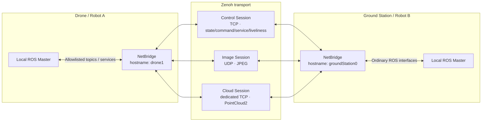

<div align="center">

# NetBridgeForSwarm

### A lightweight, resilient, and bandwidth-efficient ROS1 Noetic bridge for multi-robot systems

Keep an independent ROS Master on every robot while Zenoh carries selected topics, services,
and node-presence information between machines. NetBridgeForSwarm is designed to simplify
**complex ROS1 networking, improve multi-host stability, and reduce communication overhead**.

[](#environment-and-compatibility)
[](#environment-and-compatibility)
[](#installation)
[](swarm_ros_bridge/CMakeLists.txt)
[](#environment-and-compatibility)
[](LICENSE.txt)

[简体中文](README-zh.md)

[Quick Start](#quick-start) · [Configuration](#configuration-reference) · [Deployment](#deployment-guide) · [Monitoring](#running-and-monitoring) · [Troubleshooting](#troubleshooting)

</div>

---

## Project overview

NetBridgeForSwarm is a communication bridge that runs beside a ROS1 Noetic node graph. Each drone, robot, or ground station connects only to its local ROS Master. The bridge subscribes to topics explicitly allowed by YAML rules, sends them through Zenoh, and republishes them as ordinary ROS topics under the destination ROS Master. ROS services are proxied between machines through Zenoh query/reply in the same way.

The bridge does not expose the entire ROS graph indiscriminately. It transports only configured data and applies separate links, priorities, queues, and compression strategies to commands, state, images, and point clouds.

### Problems this project addresses

| ROS1 multi-host problem | NetBridgeForSwarm approach | Result |
|---|---|---|
| Every machine must coordinate `ROS_MASTER_URI`, `ROS_IP`, hostname resolution, and reachable ROS ports | Keep a local ROS Master on each machine and configure only logical hosts and selected routes | Simpler deployment and scaling; a local ROS graph does not depend on a remote Master |
| Connections and node state are difficult to observe on unstable Wi-Fi, mesh, or airborne networks | Zenoh discovery or static connections, liveliness tokens, and reconnect diagnostics | Better recovery visibility and faster isolation of offline nodes or broken links |
| Images and point clouds can block control traffic, state, and services | Separate TCP control, UDP image, and dedicated TCP cloud sessions | Less head-of-line blocking of critical control traffic by bulk data |
| Raw images and point clouds consume excessive bandwidth as the swarm grows | Rate limiting, JPEG resizing and adaptive quality, VoxelGrid, Draco/PCL compression, and directed routing | Only required data is sent, with active control over large-message bandwidth |
| Stale samples accumulate during congestion and are processed after the network recovers | Bounded `state`/`bulk` queues keep the newest sample; `command` and service traffic use reliable blocking policies | Real-time streams stay fresh while critical commands and requests are protected |

### Key features

- ROS topics and services across independent ROS Masters.
- One-to-one, one-to-many, many-to-one, and fleet-wide routing through `srcIP`/`dstIP` allowlists.
- Three isolated Zenoh sessions: TCP for control/state/services, UDP for images, and dedicated TCP for point clouds.
- `command`, `state`, and `bulk` topic QoS classes with purpose-specific reliability, priority, and congestion behavior.
- Topic-name-only configuration with ROS1 connection-header discovery of type, MD5, full definition, and latching state.
- Automatic JPEG transport for `sensor_msgs/Image`, including resize and target-bandwidth adaptive quality.
- VoxelGrid downsampling plus Draco or PCL Octree compression for `sensor_msgs/PointCloud2`.
- Preservation and validation of ROS type, MD5, source host, sequence, timestamp, and `frame_id` metadata.
- Per-drone directed delivery for custom messages containing a `to_drone_ids` field.
- `/swarm_bridge/diagnostics` plus a responsive terminal UI for sessions, nodes, routes, rates, drops, and bandwidth.
- Native Ubuntu 20.04 Zenoh 1.9.0 packages and a minimal Docker runtime for `amd64` and `arm64`.

## How it works



| Session | Default traffic | Link restriction | Purpose |
|---|---|---|---|
| Control | Ordinary topics, commands, continuous state, services, and node presence | TCP | Protect critical data and request/reply traffic |
| Image | `sensor_msgs/Image`, encoded as JPEG by the bridge | UDP | Keep image loss or retransmission pressure away from control traffic |
| Cloud | `sensor_msgs/PointCloud2`, optionally compressed | Dedicated TCP | Carry large point clouds without sharing the control TCP session |

Zenoh receive callbacks only validate and enqueue envelopes. Joinable worker threads perform ROS deserialization and publication. The wire protocol uses a versioned `NBZ2` envelope; the full schema is negotiated only on the Control Session, while data packets carry lightweight type/MD5/codec metadata.

## Environment and compatibility

| Component | Supported configuration |
|---|---|
| Operating system | Ubuntu 20.04 Focal |
| ROS | ROS1 Noetic with catkin |
| CPU architecture | `amd64`, `arm64` |
| Build standard | C++17, CMake 3.16+ |
| Zenoh | `zenoh-c` / `zenoh-cpp` **exactly 1.9.0** |
| Network | Multicast discovery on one Layer-2 network, or mutually reachable static TCP/UDP endpoints |

> [!IMPORTANT]
> The bundled Zenoh `.deb` files were built natively on Ubuntu 20.04. Do not copy packages built on a different Ubuntu release into Focal, and do not mix another Zenoh version with this build. Either can cause CMake or runtime ABI incompatibilities.

Ordinary ROS1 topics no longer require compile-time registration. The bridge uses `topic_tools::ShapeShifter` to forward the original ROS serialization and dynamically advertise from the remote schema, so the receiving bridge itself does not need the corresponding message package installed.

The following types have built-in wire-codec specializations:

- `nav_msgs/Odometry`
- `sensor_msgs/Image`
- `sensor_msgs/PointCloud2`

Built-in service types:

- `std_srvs/Empty`
- `swarm_ros_bridge/AddTwoInts`

Only topics whose fields the bridge must inspect (currently `to_drone_ids`) need registration. Services still require compile-time registration; see [Adding custom message and service types](#adding-custom-message-and-service-types).

## Quick start

This walkthrough sends `/chatter` from `drone1` to `groundStation0`. Both machines run their own local ROS Master, install the same bridge version, and use the same host inventory and routing rules.

### 1. Install system dependencies

Install ROS Noetic using the [official Ubuntu instructions](http://wiki.ros.org/noetic/Installation/Ubuntu), then run the following on every machine:

```bash
sudo apt-get update
sudo apt-get install -y \
  build-essential \
  cmake \
  git \
  libopencv-dev \
  libpcl-dev \
  ros-noetic-message-generation \
  ros-noetic-pcl-conversions \
  ros-noetic-topic-tools \
  ros-noetic-visualization-msgs
```

### 2. Create a catkin workspace and clone the repository

```bash
source /opt/ros/noetic/setup.bash
mkdir -p ~/netbridge_ws/src
cd ~/netbridge_ws/src
git clone https://github.com/Gaiwqqq/NetBridgeForSwarm.git
cd NetBridgeForSwarm
```

FTXUI, Draco, and the adapted `cv_bridge` package are included in the repository. No additional submodules are required.

### 3. Install Zenoh 1.9.0

Verify the bundled binary packages, then install the directory matching the current CPU architecture:

```bash
cd ~/netbridge_ws/src/NetBridgeForSwarm/zenoh-debs
sha256sum -c SHA256SUMS

cd ..
sudo dpkg -i "./zenoh-debs/$(dpkg --print-architecture)"/*.deb
```

Verify the installed versions:

```bash
dpkg-query -W libzenohc libzenohc-dev libzenohcpp-dev
```

All three packages should report version `1.9.0`. If the current architecture is neither `amd64` nor `arm64`, follow [Rebuilding the Zenoh Debian packages](#rebuilding-the-zenoh-debian-packages).

### 4. Build

```bash
cd ~/netbridge_ws
source /opt/ros/noetic/setup.bash
catkin_make \
  -DCMAKE_BUILD_TYPE=Release \
  -DCV_BRIDGE_BUILD_PYTHON=OFF \
  -DPYTHON_EXECUTABLE=/usr/bin/python3
source devel/setup.bash
```

Verify that ROS can locate the package:

```bash
rospack find swarm_ros_bridge
```

Source both environments in every new terminal:

```bash
source /opt/ros/noetic/setup.bash
source ~/netbridge_ws/devel/setup.bash
```

### 5. Configure the host inventory

Edit [`swarm_ros_bridge/config/ip_real.yaml`](swarm_ros_bridge/config/ip_real.yaml) so every local bridge name is present:

```yaml
hosts:
  - groundStation0
  - drone1
```

These are bridge-level **logical host names**, not Linux hostnames or IP addresses. A name beginning with `drone` must have a numeric suffix, such as `drone1`.

### 6. Add a minimal topic route

Add this rule to the `topics` list in [`swarm_ros_bridge/config/default.yaml`](swarm_ros_bridge/config/default.yaml):

```yaml
- topic_name: /chatter
  qos_class: state
  srcIP: [drone1]
  dstIP: [groundStation0]
  max_freq: 10
  prefix: true
  same_prefix: false
```

`srcIP` and `dstIP` are legacy-compatible field names. Their values are the logical host names defined above, not IP addresses.

### 7. Start and verify

On `drone1`:

```bash
export DRONE_ID=1
roslaunch swarm_ros_bridge example_bridge_drone.launch
```

Publish a test message from another `drone1` terminal:

```bash
rostopic pub -r 2 /chatter std_msgs/String "data: 'hello from drone1'"
```

On `groundStation0`:

```bash
roslaunch swarm_ros_bridge example_bridge_station.launch
```

Receive the bridged topic from another ground-station terminal:

```bash
rostopic echo /drone1/chatter
```

Continuous output confirms that the local ROS graphs, bridge route, and Zenoh network are connected. The `/drone1` prefix comes from `prefix: true`; see [Topic names and prefixes](#topic-names-and-prefixes).

## Installation

### Native installation

Native installation is recommended when integrating the bridge into an existing ROS1 system. Follow the complete [Quick start](#quick-start), then keep these deployment rules in mind:

1. Pin every machine to the same repository commit and Zenoh version.
2. Use the same `hosts`, topic rules, service rules, and message definitions on all participating machines.
3. Machines may use different `listen_endpoints` and `connect_endpoints` when building a static topology.
4. Source `<workspace>/devel/setup.bash` from the environment that launches the ROS stack.

### Docker installation

The repository [`Dockerfile`](Dockerfile) uses a multi-stage `ros:noetic-ros-core-focal` build. The final image contains only runtime dependencies, the Zenoh package for the current architecture, and the installed bridge.

```bash
cd ~/netbridge_ws/src/NetBridgeForSwarm
docker build --build-arg BUILD_JOBS=4 -t netbridge:noetic .
```

The default command starts the ground-station configuration. Host networking is recommended because Zenoh discovery uses multicast and the container commonly needs access to the host ROS network:

```bash
docker run --rm --network host netbridge:noetic
```

Start a drone bridge:

```bash
docker run --rm --network host \
  -e DRONE_ID=1 \
  netbridge:noetic \
  roslaunch swarm_ros_bridge example_bridge_drone.launch
```

Mount custom configuration files read-only over the installed defaults:

```bash
docker run --rm --network host \
  -e DRONE_ID=1 \
  -v "$(pwd)/swarm_ros_bridge/config/default.yaml:/opt/netbridge/share/swarm_ros_bridge/config/default.yaml:ro" \
  -v "$(pwd)/swarm_ros_bridge/config/ip_real.yaml:/opt/netbridge/share/swarm_ros_bridge/config/ip_real.yaml:ro" \
  netbridge:noetic \
  roslaunch swarm_ros_bridge example_bridge_drone.launch
```

When the container must join an existing ROS Master, also provide the correct `ROS_MASTER_URI`. With host networking and a Master on the same machine, it is normally `http://127.0.0.1:11311`.

### Rebuilding the Zenoh Debian packages

Use this path only when the repository does not include the target architecture or when reproducing the packages from source. Build natively on Ubuntu 20.04 for the target architecture; the script does not cross-compile.

```bash
sudo apt-get install -y build-essential cmake git curl dpkg-dev
```

Install and pin Rust 1.93 with the official [`rustup`](https://rust-lang.org/tools/install.html):

```bash
curl --proto '=https' --tlsv1.2 -sSf https://sh.rustup.rs | \
  sh -s -- -y --profile minimal --default-toolchain 1.93.0
source "$HOME/.cargo/env"
rustup default 1.93.0
```

Build and install the packages:

```bash
cd ~/netbridge_ws/src/NetBridgeForSwarm
./swarm_ros_bridge/scripts/build_zenoh_1_9_debs.sh \
  --work-dir /tmp/zenoh-1.9-build \
  --output-dir "./zenoh-debs/$(dpkg --print-architecture)"
sudo dpkg -i "./zenoh-debs/$(dpkg --print-architecture)"/*.deb
```

The script pins Zenoh tag `1.9.0`, enables the reliability API required by this project, and disables shared memory.

## Configuration reference

### Configuration files and loading order

The example launch files load two YAML files into the private ROS parameter namespace of each bridge:

| File | Purpose | Consistency requirement |
|---|---|---|
| [`config/default.yaml`](swarm_ros_bridge/config/default.yaml) | Runtime options, Zenoh sessions, topics, and services | Routes and codec options should match; static endpoints may differ per machine |
| [`config/ip_real.yaml`](swarm_ros_bridge/config/ip_real.yaml) | Logical host inventory for real machines | Same on all machines |
| [`config/default_sim.yaml`](swarm_ros_bridge/config/default_sim.yaml) | Example simulation routes | Same within one simulation |
| [`config/ip_sim.yaml`](swarm_ros_bridge/config/ip_sim.yaml) | Simulation host inventory | Same within one simulation |
| [`config/zenoh_three_session_example.yaml`](swarm_ros_bridge/config/zenoh_three_session_example.yaml) | Fixed-port, three-session reference | Adapt and load according to the network topology |

The resulting parameter layout is:

```yaml
hostname: drone1       # Normally set with <param> in the launch file
config:                # Runtime behavior
zenoh:                 # Network and session behavior
hosts:                 # Complete logical host inventory
topics:                # Topic routing rules
services:              # Service routing rules
```

> [!TIP]
> After changing routes, make sure the related nodes load the same configuration version. Data is rejected when the sender is not allowed, the receiver does not allow the source, or the ROS type/MD5 differs.

### Host identity and inventory

```yaml
hosts:
  - groundStation0
  - drone1
  - drone2
```

- `hostname`: unique logical name of the current bridge; it must appear in `hosts`.
- `hosts`: every logical host that routing rules may reference; no IP addresses or ports belong here.
- `all`: selector allowed only inside `srcIP`, `dstIP`, and `clientIp`; selects every host.
- `all_drone`: route selector for every host whose name starts with `drone`.
- `droneN`: `N` must be an integer; the example launch files construct this name from `DRONE_ID=N`.

The legacy `IP` map can still replace `hosts`:

```yaml
IP:
  groundStation0: 192.168.10.100
  drone1: 192.168.10.11
```

Use it only for compatibility or with `seed_from_ip_table`. New deployments should prefer `hosts` and explicit `connect_endpoints`.

### Runtime options: `config`

```yaml
config:
  debug: false
  odom_convert: true
  monitor_node: true
  warn_threshold: 3
  monitor_rate_hz: 500
```

| Field | Default | Current behavior |
|---|---:|---|
| `debug` | `false` | When `true`, allows the same host to instantiate both the send and receive side of a topic for loopback testing; keep it `false` in production |
| `odom_convert` | `true` | Compatibility field. The current Odometry path always transports only a pose subset and reconstructs it on receipt |
| `monitor_node` | `true` | Read by the TUI configuration view; it does not currently alter bridge transport behavior |
| `warn_threshold` | `3` | Retained monitoring field; current diagnostics use measured rate, drops, and stability metrics |
| `monitor_rate_hz` | `500` | Retained monitoring field; it is not the topic rate or TUI refresh rate |

> [!CAUTION]
> The current `nav_msgs/Odometry` wire payload preserves sequence, timestamp, `child_frame_id`, and pose only. The receiver fixes `header.frame_id` to `world`. The original `header.frame_id`, twist, and both covariance arrays are not transported. Review the implementation before relying on complete Odometry messages.

### Three Zenoh sessions

Default configuration:

```yaml
zenoh:
  mode: peer
  multicast_scouting: true
  gossip_scouting: true
  compression_enabled: false
  listen_endpoints: []
  connect_endpoints: []
  seed_from_ip_table: false
  seed_port: 7447
  service_timeout_ms: 1000
  service_worker_threads: 2
  service_queue_capacity: 64

  image_session:
    enabled: true
    multicast_scouting: true
    gossip_scouting: true
    compression_enabled: false
    listen_endpoints:
      - "udp/0.0.0.0:0?rel=1;mixed_rel=1;multistream=1"
    connect_endpoints: []
    seed_from_ip_table: false
    seed_port: 7448

  cloud_session:
    enabled: true
    multicast_scouting: true
    gossip_scouting: true
    multicast_address: "224.0.0.225:7446"
    compression_enabled: false
    listen_endpoints:
      - "tcp/0.0.0.0:0"
    connect_endpoints: []
    seed_from_ip_table: false
    seed_port: 7449
```

Root-level fields configure the Control Session. `image_session` and `cloud_session` override settings for image and point-cloud traffic.

#### Common Zenoh fields

| Field | Default | Description |
|---|---:|---|
| `mode` | `peer` | Zenoh mode: `peer`, `client`, or `router`; a robot LAN normally uses `peer` |
| `multicast_scouting` | `true` | Discover other Zenoh nodes through multicast |
| `gossip_scouting` | `true` | Continue discovering topology through connected nodes |
| `multicast_address` | Zenoh default | Override the scouting multicast address; Cloud uses a separate default address to isolate the two TCP discovery domains |
| `compression_enabled` | `false` | Generic Zenoh compression; normally disable it because JPEG and Draco are already compressed |
| `listen_endpoints` | `[]` | Endpoints on which this session listens; an empty root list leaves the choice to Zenoh defaults |
| `connect_endpoints` | `[]` | Static endpoints to which this session connects |
| `seed_from_ip_table` | `false` | Generate remote endpoints from the legacy `IP` map; a `hosts` list has no IP values to use |
| `seed_port` | Control `7447`, Image `7448`, Cloud `7449` | Port used with `seed_from_ip_table`; it does not open firewall rules |

When dedicated sessions are enabled, endpoint protocols are validated: Control accepts only `tcp/`, Image only `udp/`, and Cloud only `tcp/`. Image and Cloud each require at least one listen or connect endpoint.

`rel=1;mixed_rel=1` gives a UDP link both Reliable and BestEffort channels, while `multistream=1` separates streams by priority. Zenoh performs JPEG fragmentation and reassembly. Image and Cloud do not publish duplicate liveliness tokens; node presence is owned by the Control Session.

#### Service transport fields

| Field | Default | Description |
|---|---:|---|
| `service_timeout_ms` | `1000` | Time a client waits for Zenoh query/reply, in milliseconds; clamped to at least `1` |
| `service_worker_threads` | `2` | Worker count for remote service requests on the server; clamped to at least `1` |
| `service_queue_capacity` | `64` | Maximum requests waiting for workers; overflow is rejected and reported in diagnostics |

These fields apply to ROS services on the Control Session.

### Common topic configuration

```yaml
topics:
  - topic_name: /ekf_quat/ekf_odom
    qos_class: state
    srcIP: [drone1]
    dstIP: [groundStation0]
    max_freq: 30
    prefix: false
    same_prefix: false
```

| Field | Required | Description |
|---|:---:|---|
| `topic_name` | Yes | ROS topic subscribed on the source; must begin with `/`; supports a `/drone_{id}/...` placeholder |
| `qos_class` | Yes | `command`, `state`, or `bulk`; `service` is not valid for a topic |
| `srcIP` | Yes | Logical hosts allowed to send the topic; accepts `all` and `all_drone` |
| `dstIP` | Yes | Logical hosts that should receive the topic; accepts `all` and `all_drone` |
| `max_freq` | Yes | Bridge forwarding limit in Hz; `-1` disables rate limiting; use a positive value or `-1` |
| `prefix` | No | Add the source-host prefix on the receiver; defaults to `true` |
| `same_prefix` | No | Publish below a shared `/bridge` prefix; defaults to `false` and takes precedence over `prefix` |

`max_freq` controls only bridge forwarding; it does not modify the source publisher. Samples above the limit are dropped before encoding and counted in diagnostics.

If a legacy `msg_type` field remains in the configuration, bridge startup fails with an instruction to remove it so that the value cannot be mistaken for a validation source. A rule remains `discovering` while no source publisher exists and becomes `ready` after the first ROS connection handshake.

#### Schema discovery and consistency

The source reads `datatype`, `md5sum`, `message_definition`, and `latching` from the ROS1 connection header and registers a `source host + logical topic` schema on the Control Session. Receivers fetch the schema before dynamically creating their ROS publishers; early data is retained by the existing QoS-bounded queue while negotiation completes.

Within one YAML topic rule, every discovered source must have the same `datatype + ROS MD5 + routing mode + wire codec`. ROS MD5 already covers nested message dependencies; the full definition is used for dynamic publication and is not text-compared for comments or whitespace. A mismatched source, invalid definition, or runtime schema change puts the whole rule into sticky `conflict`: its ROS publisher is shut down, queued data is cleared, and later samples are rejected while unrelated topics and services continue. Correct the deployment and restart the bridge to clear the quarantine.

#### Choosing a QoS class

| `qos_class` | Zenoh policy | Receive queue | Recommended data |
|---|---|---|---|
| `command` | Reliable / RealTime / Block / Express | Up to 64 entries; does not replace old data | Takeoff, landing, mode changes, one-shot goals |
| `state` | BestEffort / DataHigh / Drop / Express | Keeps the newest single sample | Odometry, pose, velocity, continuous state |
| `bulk` | BestEffort / DataLow / Drop | Keeps the newest single sample | Image, PointCloud2, MarkerArray, large arrays |
| Service | Reliable / InteractiveHigh / Block / Express | Dedicated worker queue | Selected automatically by the bridge; not a topic value |

Images and point clouds should use `bulk` in a normal deployment. Assigning high-rate continuous data to `command` can accumulate stale samples and apply backpressure during network degradation.

#### Topic names and prefixes

For a source named `drone1` and configured topic `/camera/image`:

| `prefix` | `same_prefix` | Receiver topic | Intended use |
|:---:|:---:|---|---|
| `false` | `false` | `/camera/image` | Preserve the name when there is exactly one source |
| `true` | `false` | `/drone1/camera/image` | Aggregate several sources without collisions; recommended |
| Any | `true` | `/bridge/camera/image` | Compatibility with an existing `/bridge` namespace |

Do not use `same_prefix: true` when several sources map the same topic to one destination. It creates duplicate receive topics and causes bridge startup to fail.

`/drone_{id}/...` is expanded from the logical hostname. For example, `drone3` resolves `/drone_{id}/odom` to `/drone_3/odom`.

### Image configuration

Image rules contain the common topic fields and may add:

```yaml
- topic_name: /camera/color/image_raw
  qos_class: bulk
  imgResizeRate: 1.0
  imgJpegQuality: 85
  imgAdaptiveQuality: true
  imgMinJpegQuality: 40
  imgMaxJpegQuality: 90
  imgTargetBandwidthKbps: 800
  imgQualityStep: 5
  imgAdaptCooldownFrames: 6
  srcIP: [drone1]
  dstIP: [groundStation0]
  max_freq: 24
  prefix: true
  same_prefix: false
```

| Field | Default | Description |
|---|---:|---|
| `imgResizeRate` | `1.0` | Width and height scale; `0.5` halves both dimensions; recommended range `(0, 1]` |
| `imgJpegQuality` | `80` | Initial JPEG quality, clamped to `10–100` |
| `imgAdaptiveQuality` | `false` | Adjust quality using recent transmitted JPEG payload bandwidth |
| `imgMinJpegQuality` | `45` | Adaptive lower bound, clamped to `10–100` |
| `imgMaxJpegQuality` | `90` | Adaptive upper bound, at least the minimum and no greater than `100` |
| `imgTargetBandwidthKbps` | `1200` | Target JPEG payload bandwidth for this image rule, in kbit/s |
| `imgQualityStep` | `5` | Quality adjustment per step; minimum `1` |
| `imgAdaptCooldownFrames` | `8` | Minimum sent frames between adjustments; minimum `1` |

Adaptive quality measures roughly the last three seconds of payload traffic. It lowers quality above `115%` of target and raises it below `85%`. The target excludes Zenoh, UDP/IP, and link-layer overhead, so actual interface traffic is slightly higher.

The sender converts every input image to `BGR8` before JPEG encoding, and the receiver publishes `BGR8`. Original `seq`, `stamp`, and `frame_id` are restored, but the original image encoding is not preserved.

### Point-cloud configuration

```yaml
- topic_name: /lidar/points
  qos_class: bulk
  cloudCompress: true
  cloudDownsample: 0.10
  cloudCodec: draco
  srcIP: [drone1]
  dstIP: [groundStation0]
  max_freq: 5
  prefix: true
  same_prefix: false
```

| Field | Default | Description |
|---|---:|---|
| `cloudCompress` | `false` | Enable point-cloud-specific compression |
| `cloudDownsample` | `-1.0` | VoxelGrid leaf size in cloud coordinate units; a positive value enables it and `-1` disables it |
| `cloudCodec` | `raw` | With compression enabled, choose `draco` or `pcl_octree`; `cloudCompress: true` without a codec defaults to `pcl_octree` |

Codec guidance:

- `draco`: recommended. Supports standard `float32 x/y/z`, packed `rgb`/`rgba` (`FLOAT32` or `UINT32`), and separate `uint8 r/g/b[/a]`. It preserves the field schema, organized layout, row padding, and side fields such as intensity or ring. XYZ positions use lossy 14-bit quantization.
- `pcl_octree`: legacy-compatible. Encodes only `PointXYZ` using `LOW_RES_ONLINE_COMPRESSION_WITHOUT_COLOR`; do not use it when color or side fields are required.
- `raw`: ordinary ROS serialization without point-cloud compression; use it on a high-bandwidth LAN when numerical losslessness matters more than traffic volume.

`cloudDownsample` runs before compression and changes point count and cloud dimensions. Values below `1e-4` or above `1e4` are treated as disabled.

### Service configuration

```yaml
services:
  - srv_name: /add_two_ints
    srv_type: swarm_ros_bridge/AddTwoInts
    serverIp: drone1
    clientIp: [groundStation0, drone2]
    prefix: true
```

| Field | Required | Description |
|---|:---:|---|
| `srv_name` | Yes | Local ROS service on the server; must begin with `/` |
| `srv_type` | Yes | Service type registered in `SRVS_MACRO` |
| `serverIp` | Yes | Logical hostname of the single server |
| `clientIp` | Yes | Hosts allowed to create a client proxy; accepts `all` and `all_drone` |
| `prefix` | No | If `true`, expose the client proxy as `/<server>/<service>`; defaults to `true` |

In this example, `drone1` keeps the local `/add_two_ints` service while `groundStation0` and `drone2` call:

```bash
rosservice call /drone1/add_two_ints "a: 1
b: 2"
```

The server validates that the envelope source is listed in `clientIp` and that the service type and MD5 match. A host cannot be both server and client for the same rule.

### Directed routing with `to_drone_ids`

When a registered custom message contains a `to_drone_ids` field of type `std::vector<uint8_t>`, the bridge enables dynamic directed routing:

1. `dstIP` defines the allowed candidate destinations.
2. ID `N` in a message maps to logical host `droneN`.
3. The message is published only on `netbridge/v2/topic/<source>/dst/<target>/...` keys.
4. A target absent from `dstIP` is rejected and counted as a drop.

This supports commands that carry different drone targets on one ROS topic without requiring every drone to receive and filter every message.

### Adding custom message and service types

An ordinary custom topic requires no bridge, `package.xml`, or CMake changes: configure only its `topic_name`, and the bridge transparently carries its schema and serialized bytes. Add a message to `MSGS_MACRO` only when the bridge must inspect its `to_drone_ids` field:

Edit [`swarm_ros_bridge/include/msgs_macro.hpp`](swarm_ros_bridge/include/msgs_macro.hpp):

```cpp
#include <your_pkg/YourMessage.h>
#include <your_pkg/YourService.h>

#define MSGS_MACRO \
  X("your_pkg/YourMessage", your_pkg::YourMessage)

#define SRVS_MACRO \
  /* Keep the existing entries. */ \
  X("your_pkg/YourService", your_pkg::YourService)
```

For field-level topic specializations and services, add dependencies to [`swarm_ros_bridge/package.xml`](swarm_ros_bridge/package.xml) and [`swarm_ros_bridge/CMakeLists.txt`](swarm_ros_bridge/CMakeLists.txt), then rebuild. A receiving bridge does not need an ordinary topic's message package, although the ROS application that subscribes to it must understand the type. Runtime ROS MD5 validation enforces identical message definitions.

## Deployment guide

### Option A: multicast discovery on one LAN

Use the default configuration when multicast is available and all nodes share a Layer-2 network or VLAN:

- `mode: peer`
- `multicast_scouting: true`
- `connect_endpoints: []` in all three sessions
- A dynamic UDP listener for Image and a dynamic TCP listener for Cloud

This avoids per-machine IP maintenance. Enterprise Wi-Fi, some mesh networks, VPNs, and routed networks may filter the required multicast.

### Option B: fixed endpoints

When multicast is unavailable, configure a static topology for Control, Image, and Cloud. The conventional ports are `7447`, `7448`, and `7449`.

Ground station listeners:

```yaml
zenoh:
  multicast_scouting: false
  listen_endpoints: ["tcp/0.0.0.0:7447"]
  connect_endpoints: []
  image_session:
    enabled: true
    multicast_scouting: false
    listen_endpoints: ["udp/0.0.0.0:7448?rel=1;mixed_rel=1;multistream=1"]
    connect_endpoints: []
  cloud_session:
    enabled: true
    multicast_scouting: false
    listen_endpoints: ["tcp/0.0.0.0:7449"]
    connect_endpoints: []
```

Drone connections, assuming the ground station is `192.168.10.100`:

```yaml
zenoh:
  multicast_scouting: false
  listen_endpoints: []
  connect_endpoints: ["tcp/192.168.10.100:7447"]
  image_session:
    enabled: true
    multicast_scouting: false
    listen_endpoints: []
    connect_endpoints:
      - "udp/192.168.10.100:7448?rel=1;mixed_rel=1;multistream=1"
  cloud_session:
    enabled: true
    multicast_scouting: false
    listen_endpoints: []
    connect_endpoints: ["tcp/192.168.10.100:7449"]
```

You may retain local listeners to build a direct peer mesh between drones. See [`zenoh_three_session_example.yaml`](swarm_ros_bridge/config/zenoh_three_session_example.yaml) for a complete fixed-port reference.

### Physical deployment checklist

- Each machine uses an available local ROS Master; the entire fleet does not need to share one Master.
- Every `hostname` is unique and appears in the common `hosts` inventory.
- Topic/service types, MD5 sums, route rules, and bridge versions match.
- Multicast is allowed for discovery mode, or the required TCP/UDP ports are allowed for static mode.
- Images and clouds use `bulk`, control commands use `command`, and continuous state uses `state`.
- Machine clocks are synchronized with NTP or chrony; otherwise cross-host latency metrics are inaccurate.
- Current UDP endpoints are unencrypted and are used only on a trusted, isolated robot network.
- Complete the functional, weak-network, bandwidth, and rollback checks in [`ZENOH_VALIDATION.md`](swarm_ros_bridge/docs/ZENOH_VALIDATION.md) before rollout.

## Running and monitoring

### Launch files

| Command | Purpose |
|---|---|
| `roslaunch swarm_ros_bridge example_bridge_drone.launch` | Start a drone bridge; requires `DRONE_ID` |
| `roslaunch swarm_ros_bridge example_bridge_station.launch` | Start the `groundStation0` bridge |
| `roslaunch swarm_ros_bridge bridge_with_tui_drone.launch` | Start a drone bridge and TUI |
| `roslaunch swarm_ros_bridge bridge_with_tui_station.launch` | Start the ground-station bridge and TUI |

Drone example:

```bash
export DRONE_ID=2
roslaunch swarm_ros_bridge bridge_with_tui_drone.launch
```

The TUI refreshes every 500 ms and reflows when the terminal is resized:

- Narrow: top navigation and compact lists.
- Medium: vertically stacked list and detail panels.
- Wide: sidebar and side-by-side inspectors.
- Validated minimum: `40x12`; `80x24` or larger is recommended.

### Diagnostics topic

```bash
rostopic echo /swarm_bridge/diagnostics
```

The bridge publishes diagnostics once per second, including:

- `@zenoh/session/control`: Control TCP Session.
- `@zenoh/session/image`: Image UDP Session.
- `@zenoh/session/cloud`: Cloud TCP Session.
- `@zenoh/node/<hostname>`: node liveliness and online transitions.
- Per-topic send/receive rate, bandwidth, average latency, jitter, stability, drops, and codec.
- Session-open and link state, peer/router counts, estimated reconnects, decode errors, service timeouts, and queue drops.

Image receive rows also include:

| Metric | Meaning |
|---|---|
| `image_loss_rate_pct` | End-to-end complete-frame loss inferred from bridge-envelope sequence gaps; not raw UDP datagram loss |
| `complete_frame_success_rate_pct` | JPEG frames decoded and published divided by expected frames |
| `effective_recv_bandwidth_kbps` | JPEG payload bandwidth successfully decoded and published over roughly the last three seconds |
| `expected_frames` | Frames expected from observed sequence numbers |
| `transport_complete_frames` | Complete envelopes received |
| `decoded_frames` | Frames successfully decoded and published |
| `inferred_lost_frames` | Frames inferred missing from sequence gaps |

TUI node states:

- `ONLINE`: a Zenoh liveliness token is currently present.
- `OFFLINE`: the node was observed previously, but its token disappeared.
- `UNKNOWN`: the local bridge has not observed the node, or diagnostics have not updated for more than 2.5 seconds.
- `LIVE` / `STALE` / `WAIT`: the diagnostics stream is current, expired, or not yet observed.

### Zenoh key space

| Data | Key format |
|---|---|
| Fanout/fixed-route topic | `netbridge/v2/topic/<source>/fanout/<ros-topic>` |
| `to_drone_ids` directed topic | `netbridge/v2/topic/<source>/dst/<hostname>/<ros-topic>` |
| Topic schema | `netbridge/v2/schema/<source>/<ros-topic>` |
| Service | `netbridge/v2/service/<server>/<ros-service>` |
| Node presence | `netbridge/v2/alive/<hostname>` |

These keys are an internal protocol. A custom Zenoh application must implement the `NBZ2` envelope, schema request/response, and ROS type/MD5 checks. `NBZ1` and `NBZ2` are incompatible, so upgrade every bridge together.

## Testing

After building, run the local tests from the catkin workspace root:

```bash
./devel/lib/swarm_ros_bridge/test_bridge_transport
./devel/lib/swarm_ros_bridge/test_draco_pointcloud_codec
./devel/lib/swarm_ros_bridge/test_zenoh_transport_smoke
./devel/lib/swarm_ros_bridge/test_zenoh_three_session_smoke
./devel/lib/swarm_ros_bridge/test_topic_metrics
./devel/lib/swarm_ros_bridge/test_tui_layout
```

The end-to-end test starts three isolated ROS Masters and simulates `drone1 + drone2 + groundStation0`. It covers many-to-one and one-to-many Odometry, Image, and Draco PointCloud2 transport, plus a dynamic custom `swarm_ros_bridge/NetworkInfo` topic that is absent from `MSGS_MACRO`:

```bash
cd ~/netbridge_ws
./src/NetBridgeForSwarm/swarm_ros_bridge/scripts/three_node_transport_test.sh
```

The full topic-routing matrix starts four isolated ROS Masters. Two sources and
two destinations exercise many-to-one, one-to-many, and strict 2x2
many-to-many routing for Odometry, Image, Draco PointCloud2, and an unregistered
custom message. It also checks schema MD5/codec/transport consistency,
non-destination isolation, multi-source conflicts, and runtime type-change
quarantine:

```bash
cd ~/netbridge_ws
./src/NetBridgeForSwarm/swarm_ros_bridge/scripts/topic_routing_matrix_test.sh
```

See [`swarm_ros_bridge/docs/ZENOH_VALIDATION.md`](swarm_ros_bridge/docs/ZENOH_VALIDATION.md) for physical-link acceptance, weak-network testing, rollout, and rollback criteria.

## Troubleshooting

### CMake cannot find Zenoh 1.9.0

```text
Could not find a configuration file for package "zenohc"
```

Check that all three native packages are installed at version 1.9.0:

```bash
dpkg-query -W libzenohc libzenohc-dev libzenohcpp-dev
```

If another version is installed, remove the conflict and repeat [Install Zenoh 1.9.0](#3-install-zenoh-190).

### Bridge reports a `hostname` or host-route error

- `cannot find hostname parameter or DRONE_ID`: use an example launch file or set private parameter `~hostname`.
- `local hostname is missing from hosts/IP configuration`: add the current `hostname` to `hosts`.
- `unknown host in route`: check spelling in `srcIP`, `dstIP`, `clientIp`, and the host inventory.
- An exception from `stoi`: a name beginning with `drone` does not have a numeric suffix.

### Nodes remain `UNKNOWN` or topics do not cross machines

1. Confirm that the bridge is running on both sides, not only the ROS Masters.
2. Check whether the AP, VLAN, or VPN filters discovery multicast.
3. Disable multicast temporarily and configure all three sessions using [fixed endpoints](#option-b-fixed-endpoints).
4. Make sure the firewall permits Control TCP, Image UDP, and Cloud TCP.
5. Verify matching route directions and confirm `ready` schema state in the TUI; `conflict` includes the type, MD5, route, or codec mismatch reason.

### Image latency or frame loss is high

- Use `qos_class: bulk` so stale frames do not queue.
- Reduce `max_freq`, then reduce `imgResizeRate` if necessary.
- Enable `imgAdaptiveQuality` and choose a realistic `imgTargetBandwidthKbps`.
- Compare `transport_complete_frames` with `decoded_frames`: the former not increasing normally indicates a link problem; the former increasing while the latter falls behind points to queue replacement or JPEG decode pressure.

### Point-cloud bandwidth or CPU use is high

- Increase the `cloudDownsample` leaf size and reduce `max_freq`.
- Use `draco` when colors or side fields are required; reserve `pcl_octree` for legacy XYZ-only cases.
- Do not enable generic Zenoh compression on top of Draco/PCL compression.
- Inspect Cloud Session `transport_queue_drops` and measured topic bandwidth.

### Service calls time out

- Confirm that the real service is registered locally on the `serverIp` machine.
- Confirm that the caller appears in `clientIp` and uses the correct prefixed name.
- Inspect `service_timeouts` and `service_queue_drops`; for slow services, increase `service_timeout_ms` or the worker count.
- Services use only the Control Session, so check its TCP connectivity first.

### Latency metrics are invalid

Average latency compares the message source timestamp with the receiving machine's current time. Unsynchronized clocks, a zero source timestamp, or a clock rollback can invalidate the value without affecting topic transport. Use chrony or NTP in physical deployments.

## Repository layout

```text
NetBridgeForSwarm/
├── swarm_ros_bridge/              # Main ROS bridge package
│   ├── config/                    # Host, route, and Zenoh configuration
│   ├── launch/                    # Drone, station, TUI, and test launch files
│   ├── docs/                      # Physical validation procedure
│   ├── include/                   # Message registry, transport, config, diagnostics
│   ├── scripts/                   # Zenoh packaging and end-to-end tests
│   ├── src/                       # Bridge, TUI, codecs, and Zenoh implementation
│   └── test/                      # Unit and smoke tests
├── cv_bridge_noetic_fit_version/  # Bundled Noetic cv_bridge adaptation
├── third_party/                   # FTXUI and Draco
├── zenoh-debs/                    # Focal amd64/arm64 Zenoh 1.9.0 packages
├── docker/                        # Container entrypoint
└── Dockerfile                     # Multi-stage minimal runtime image
```

## Security and known boundaries

- Default UDP endpoints are unencrypted. Do not expose them directly to the public Internet or an untrusted network.
- Ordinary topics support arbitrary runtime ROS1 messages; field-level routing specializations and services still require compile-time registration.
- `state` and `bulk` intentionally favor freshness through BestEffort and keep-latest behavior.
- Current Odometry transport keeps only the pose subset, images are published as `BGR8`, and Draco XYZ positions use lossy quantization.
- The supported baseline is ROS Noetic, Ubuntu 20.04, and Zenoh 1.9.0. Re-run the complete validation plan after upgrading any of them.

## Contributors

- Weiqi Gai — 2025.01
- KengHou Hoi — 2024.08

## License

This project is available under the [BSD 3-Clause License](LICENSE.txt). Third-party components remain subject to the licenses in their respective directories.
